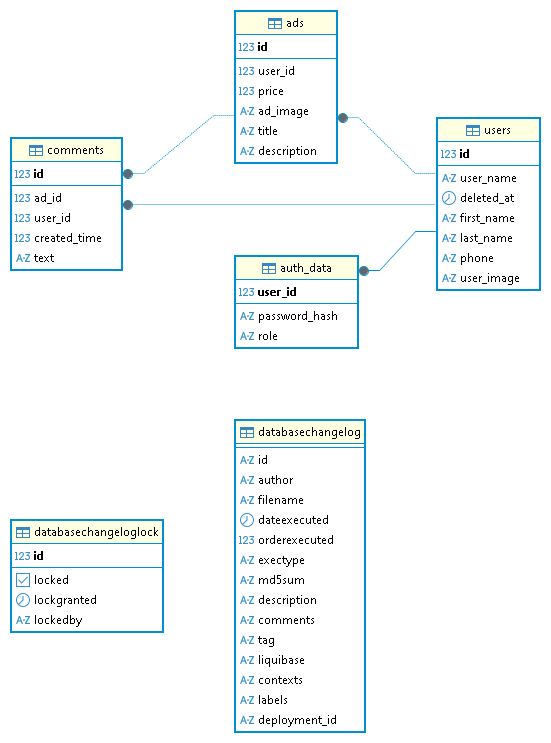
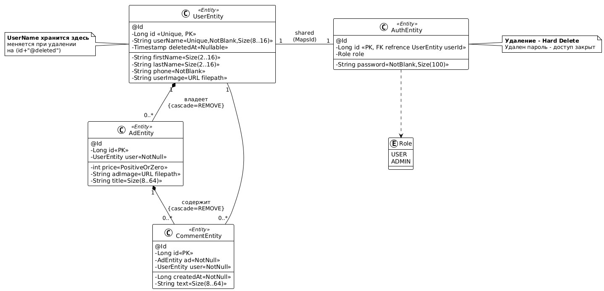

markdown
# Marketplace API (Дипломный проект)

Платформа для размещения объявлений и управления профилями пользователей.

## Текущий статус разработки
- [x] Спроектированы DTO и модели данных.
- [x] Реализован слой контроллеров (REST API).
- [x] Покрытие контроллеров модульными тестами (WebMvcTest).
- [x] Интеграция с базой данных.
- [x] Реализован персистентный слой (Entities, JPA Repositories).
- [x] Реализован слой мапперов.
- [ ] Спроектированы интерфейсы сервисов (Low Coupling).
- [ ] Реализация бизнес-логики.


## Технологический стек
* **Java 17** (Amazon Corretto)
* **Spring Boot 2.7.15** (Web, Validation, Security)
* **OpenAPI 3 (Swagger)** — документация эндпоинтов.
* **Maven** - сборка проекта.
* **JUnit 5 & Mockito** — тестирование.
* **Lombok** — сокращение шаблонного кода.
* **Hibernate** - поддержка работы с БД.
* **PostgreSQL 17**
* **MapStruct** - сокращение шаблонного кода при маппинге сущностей.
* **Liquibase** - поддержка миграций БД.
* **BCrypt** - криптоустойчивое шифрование данных авторизации.

## Архитектурные особенности

Внутренняя структура сервиса использует **многоуровневый подход** (Multi-Layer Architecture):
*   `controller`: Обработка входящих HTTP-запросов.
*   `service`: Бизнес-логика приложения, валидация, координация работы репозиториев (в разработке).
*   `repository`: Уровень доступа к данным (DAO), взаимодействие с БД через JPA.
*   `model`: Сущности БД (Entities), DTO.
*   `mappers`: Мапперы данных между entities и DTO (Lombok + MapStruct).
*   `config`: Настройка модулей приложения.
*   `filter`: Фильтры безопасного доступа (CORS-фильтры).


## Инструкция по развертыванию и запуску (Deployment Guide)

Для локального запуска или развертывания приложения выполните следующие шаги.

### 1. Требования

Убедитесь, что у вас установлены:

*   **JDK 17+**
*   **PostgreSQL** (запущенный и доступный)

*   Создана пустая база данных "resale_db" (Liquibase создаст структуру автоматически).

### 2. Клонирование проекта

```bash
git clone https://github.com/TrueRandolf/Resale-Hub-graduate-work.git
cd Resale-Hub-graduate-work
```

### 3. Настройка конфигурации (`application.yaml`)

Для запуска приложения необходимо указать актуальные параметры подключения к базе данных PostgreSQL.
`src/main/resources/application.yaml`.

*   **Настройки подключения БД:** Все параметры подключения читаются из `application.yaml`. Отредактируйте следующие поля в соответствии с вашей локальной средой:

```yaml
# SPRING settings
spring:
  application:
    name: resale-service  # application name
  # DB settings
  datasource:
    url: jdbc:postgresql://localhost:5432/resale_db
    username: Пользователь
    password: Пароль
    driver-class-name: org.postgresql.Driver

  liquibase:
    enabled: true
    change-log: classpath:db/changelog/db.changelog-master.yaml

  # Hibernate settings
  jpa:
    show-sql: true
    hibernate:
      ddl-auto: validate
    properties:
      hibernate:
        format_sql: true
        use_sql_comments: true

```
*Убедитесь, что логин, пароль и URL подходят для вашей локальной БД PostgreSQL, иначе подключение не установится.*

### 4. Сборка и запуск приложения
Вы можете собрать и запустить приложение с помощью Maven Wrapper:

```bash 
# Сборка проекта (компиляция и создание JAR-файла)
./mvnw clean install

# Запуск приложения
./mvnw spring-boot:run
```
*При первом запуске система миграций создаст в БД необходимые таблицы и индексы для работы с приложением*

Приложение будет доступно по адресу http://localhost:8080.


## Архитектура и структура кода
Проект построен по принципу **Dependency Inversion**. Контроллеры взаимодействуют с бизнес-логикой исключительно через **интерфейсы**, что позволяет:
1. Изолированно тестировать API слой с использованием моков.
2. Легко заменять реализацию сервисов без изменения контроллеров.
3. Соблюдать чистоту кода и слабую связность модулей.

Организация структуры данных:

**Диаграмма связей БД:**


**Диаграмма классов:**

